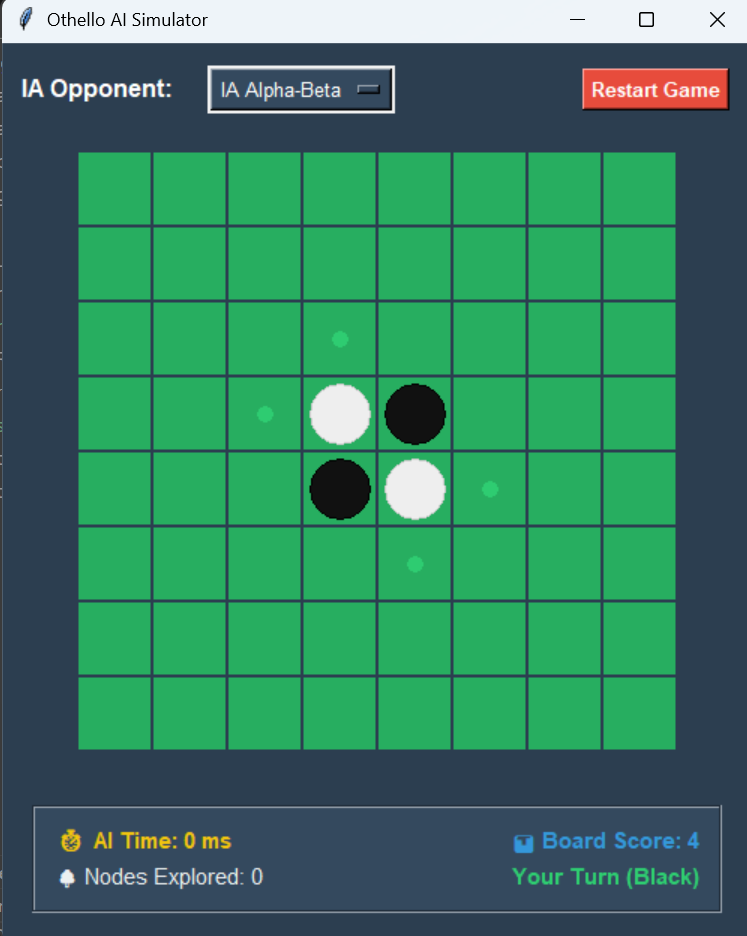

# 🧠 AI Othello Game System


A modular, Python-based testbed for analyzing and comparing Artificial Intelligence strategies in the game of Othello (Reversi). Developed as an independent research project.

## 🎯 Project Goals
The goal of this project is to create an interactive, competitive environment for testing various Search Algorithms and Heuristics. The system allows you to pit different agents against each other or play against them yourself:
- **Random AI** (Baseline)
- **Greedy AI** (Immediate Score Maximization)
- **Minimax** (Deep Tree Search)
- **Alpha-Beta Pruning** (Optimized Minimax)

## 🚀 Features
- **Modular Architecture**: Clean separation between the core Othello rules, UI rendering, and AI logic.
- **Minimax vs Alpha-Beta Optimization**: At Depth 4, **Minimax evaluates ~47,000 nodes/move**, whereas **Alpha-Beta evaluates ~6,200 nodes/move**, resulting in a **7.5x reduction** in search space while guaranteeing the exact same moves!
- **AI Difficulty Selector**: Play against 4 different AI tiers:
  - **Random AI**: Plays completely randomly.
  - **Greedy AI**: Uses a greedy 1-ply search with a basic positional heuristic.
  - **Minimax**: Searches 4 moves deep using the standard Minimax algorithm.
  - **Alpha-Beta**: Searches 4 moves deep using Alpha-Beta pruning for massive performance gains.
- **Real-Time Analytics HUD**:
  - ⏱️ **Execution Time**: Measures how many milliseconds the AI takes to compute its move.
  - 🌳 **Nodes Explored**: Tracks the number of game states evaluated in the search tree (highlighting the pruning efficiency of Alpha-Beta over standard Minimax).
  - 📊 **Board Score**: Displays the AI's internal heuristic evaluation of the current board state.

## 🏆 AI Tournament Matrix
We ran 100 automated games pitting the AIs against each other to calculate their respective win rates.

| Player 1 (Row) \ Player 2 (Col) | Random | Greedy | Minimax | Alpha-Beta |
|--------------------------------|--------|--------|---------|------------|
| **Random** | - | 20.0% | 0.0% | 0.0% |
| **Greedy** | 60.0% | - | 0.0% | 0.0% |
| **Minimax** | 100.0% | 100.0% | - | 0.0% |
| **Alpha-Beta** | 80.0% | 100.0% | 0.0% | - |

*(Note: Minimax vs Alpha-Beta results in deterministic draws, hence 0% win rate).*

## 🧩 Code Structure
- `game_engine.py`: Contains the `OthelloGame` class. Handles the pure logic (valid moves, piece flipping, win states).
- `ai_heuristics.py`: Contains the advanced board evaluation functions (`decentHeuristic`, `finalHeuristic`), incorporating edge/corner weights and mobility tracking.
- `ai_agents.py`: Contains the AI decision-making classes (`RandomAI`, `HeuristicAI`, `MinimaxAI`, `AlphaBetaAI`).
- `main_gui.py`: The Tkinter-based graphical user interface that ties the engine and agents together.

## 🎮 How to Run
Ensure you have Python and `numpy` installed.

```bash
pip install -r requirements.txt
python main_gui.py
```
Enjoy playing against the Alpha-Beta algorithm!

## 🎓 Project Context
This repository contains the core codebase for the project. The included PDF (`Intelligence Artificielle et Jeu Othello.pdf` 🇫🇷) provides the formal breakdown, mathematical proofs, and analytical conclusions drawn from this simulation.
